# Universidad ORT Uruguay

## Facultad de Ingeniería

### Obligatorio DevOps 2024 - Proyecto obligatorio para certificación

**Alejandra Medina - 295013**  
**Matías Santos - 168085**  
**Julio Peraza - 244103**

**Prof. Federico Barceló**

**2024**

---

### El desafío planteado

En el marco de la tarea obligatoria para la certificación DevOps, se le solicita al equipo presentar un plan de acción detallado que resuelva las problemáticas operativas y errores que presenta una empresa al exponer nuevas versiones de código.

Se espera que la solución mejore la colaboración, confianza y aprendizaje continuo de los interesados en la puesta en funcionamiento del sistema.

---

### La solución lograda

La solución que planteamos, basada en la incorporación de herramientas de vanguardia, altamente confiables, muy utilizadas y probadas actualmente, organiza y facilita las pruebas y el despliegue de forma automática, rápida y con un margen de error mínimo.

Esto permite a la empresa ganar confianza y prestigio en la calidad del código publicado, además de liberar recursos para dedicarse a otras tareas a nivel de negocio.

El objetivo es poder mediante los conocimientos, herramientas y laboratorios realizados, unificar los conocimientos y aplicarlos de manera enfocada a resolver nuestra tarea eficientemente.

#### Principales puntos a cumplir

- Empaquetado de aplicaciones en contenedores y manejo mediante orquestador para el despliegue.

- Despliegue automatizado mediante Terraform de la aplicación de frontend y las 4 de backend en la nube pública de AWS Amazon.

- Configuración para aplicación de ciclos completos de CI/CD

- Invocación de análisis automático de código y testing de calidad mediante proceso CI/CD desde GitHub Accions.

- Prueba adicional de test de carga, stress o específica con herramienta Postman.

#### Plan de despliegue para el frontend

- **Código fuente:** empaquetado en un bucket de **S3 de AWS**.
- **Aplicación:** accesible mediante un enlace generado para el navegador.
- **GitHub Actions:** configurado para vincular automáticamente el archivo con el bucket.

#### Plan de despliegue para las aplicaciones de backend

- **Orquestador:** Kubernetes para manejar los contenedores de los códigos fuente de las aplicaciones de backend.
- **Empaquetado:** cada aplicación Java será alojada en un contenedor Docker.
- **Configuración:** se generará un archivo Dockerfile vinculado al orquestador.

Para cada uno de los aplicativos tanto de backend como de frontend, se presenta un documento .tf, que tiene especificado
el script requerido para la creación de cada de cada una de los mismos.

En el archivo está configurada la secuencia de comandos y parámetros necesarios, para que mediante la herramienta Terraform,
se construyan los recursos indicados(el bucket S3 o el EKS según corresponda), se obtenga la imagen del aplicativo del repositorio referenciado y
se despliegue automáticamente sobre el recurso creado si todo ejecutó correctamente.

---

### Backlog de tareas

Se creó un tablero para la gestión administrativa del proyecto, con el fin de poder organizar, distribuir y ver
de forma ordenada y clara el avance y los pendientes del trabajo a realizar.

**Herramienta:** Microsoft Azure Boards  
**Link:** [https://dev.azure.com/ms168085ms/](https://dev.azure.com/ms168085ms/)

En las siguientes imagen se muestra el listado de tareas que inicialmente fue definido y el tablero de trabajo en una primera etapa:

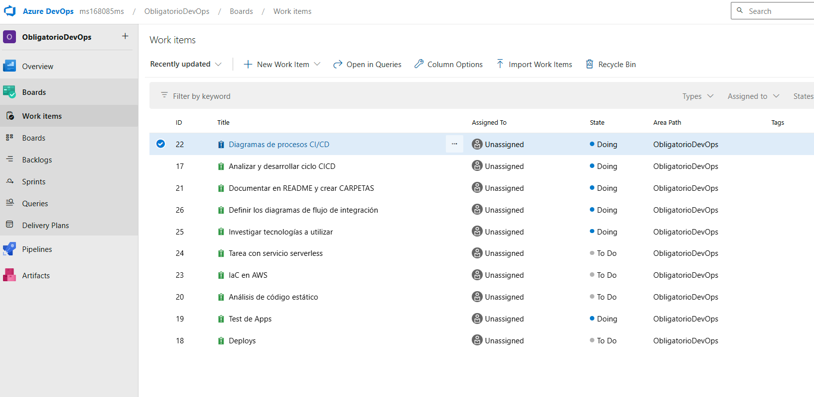

---

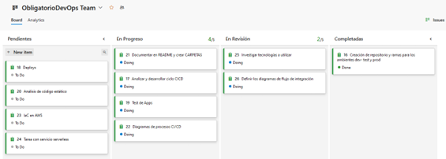

### Herramientas utilizadas:


| **Categoría**        | **Herramienta**          | **Descripción**                                                                                       |
|-----------------------|--------------------------|-------------------------------------------------------------------------------------------------------|
| **Planificación**     | **Azure Boards**         | Herramienta utilizada para armado del plan de tareas a realizar, organización y seguimiento de las mismas.    |
| **Código**            | **GitHub**               | Utilizada como plataforma colaborativa para el alojamiento de los códigos fuentes de los sistemas su organización, manejo de versionados y alojamiento de documentos.        |
|                       | **Azure Repos**          |                                                                                                       |
| **Build y CI/CD**     | **GitHub Actions**       | Herramienta de GitHub que se utilizó para la implementación de las estragias de CI/CD planificadas.         |
|                       | **Docker Hub**           | Utilizado como herramienta que brinda espacio en la nube para alojar las imágenes de los contenedores.                                              |
| **Test**              | **Postman**              | Utilizado como entorno local para validación de software y llegada a los endpoints. También utilizado en la prueba específica.                         |
|                       | **SonarCloud**           | Plataforma que permite el servicio de análisis de código estático.                                                          |
| **Deploy**            | **Kubernetes**           | Utilizado como tecnología de contenerización que permita el manejo y despliegue de los distintos contenedores que alojen los distintos sistemas.                                     |
|                       | **Terraform**            | Utilizado para programar en código la infraestructura definida, y así generar la misma automáticamente una vez se ejecute el archivo.                     |
|                       | **Docker**               |                                                                                                       |
| **Cloud**             | **AWS (Amazon Web Services)** | Proveedor que expone los diferentes servicios a utilizar en la nube, para lograr el despliegue de los sistemas.                      |


---
### CI CD WorkFlow

En los diagramas contiguos se muestra el flujo de etapas por las que avanzaría el proceso de CI/CD


### Diagrama


---

### Repositorio GitHub

El equipo resolvió crear 5 repositorios en el gestor de versiones GitHub. En los mismos se alojan el aplicativo de Frontend, los
cuatro aplicativos de backend facilitados junto a los archivos de configuración que se generen para la solución,
y un repositorio para archivos de documentación requerida.

**Organización en GitHub:** [https://github.com/ObligatorioDevOps2024](https://github.com/ObligatorioDevOps2024)

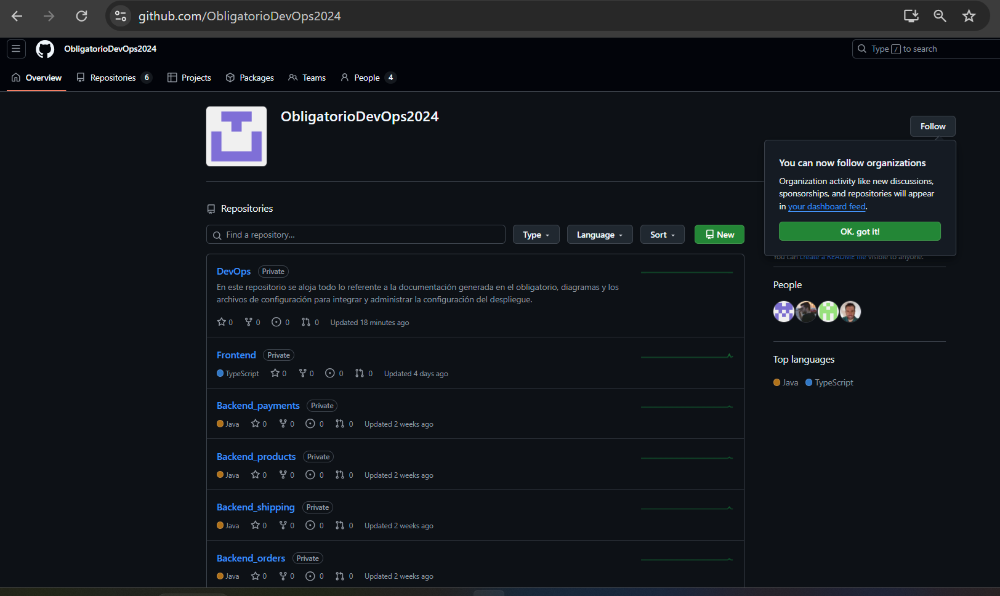

Cada repositorio cuenta con tres ramas:

- **main:** contiene el código en producción. Solo se fusionan cambios después de pasar desarrollo y pruebas.
- **dev:** rama principal de desarrollo para integrar nuevas características.
- **test:** rama para pruebas, sirve como etapa de verificación antes de producción.

# DevOps

En este repositorio se aloja todo lo referente a la documentación generada en el obligatorio, diagramas y archivos de configuración para integrar y administrar la configuración de despliegue.

---

### Compilado de las aplicaciones de forma local

Para empezar la construcción comenzamos con por la compilación y empaquetado correcto de los aplicativos a nivel local.
A continuación se dejan las capturas que evidencian las pruebas efectuadas:

1. **order-service-example**

   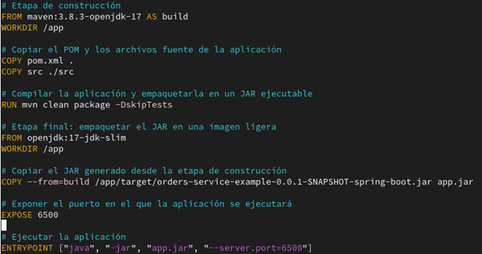

2. **payments-service-example**
   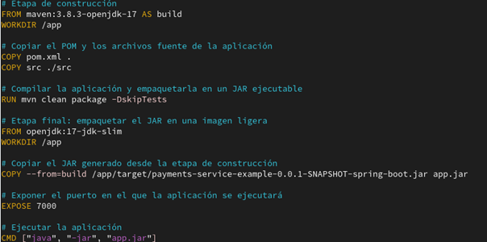

3. **shipping-service-example**

   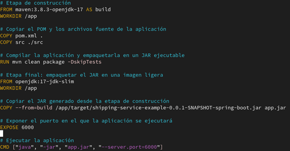

4. **products-service-example**

   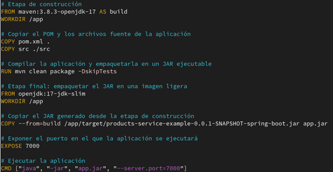

---

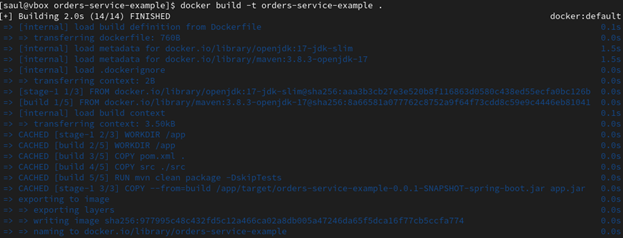

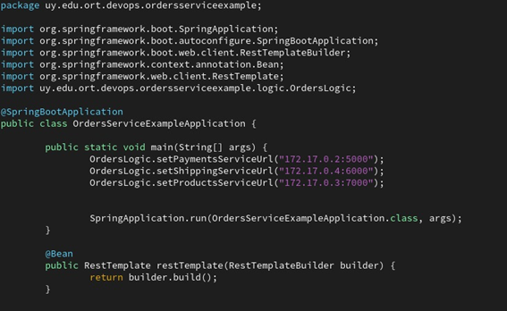

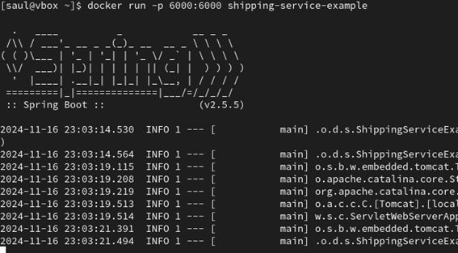

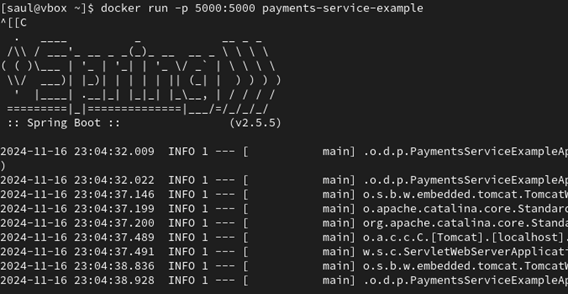

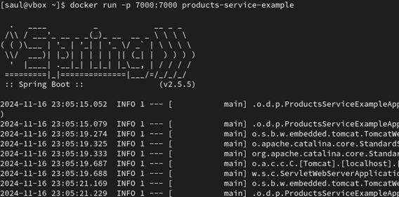

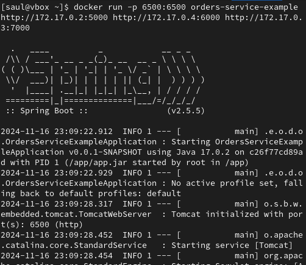

### Despliegue de aplicación de frontend (React)

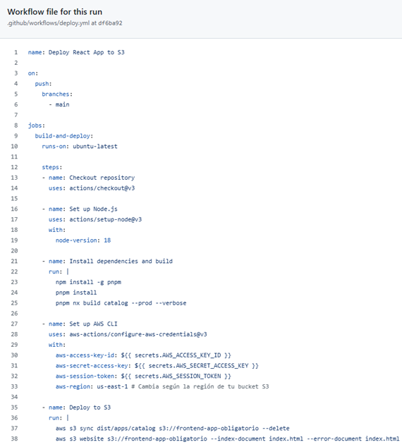

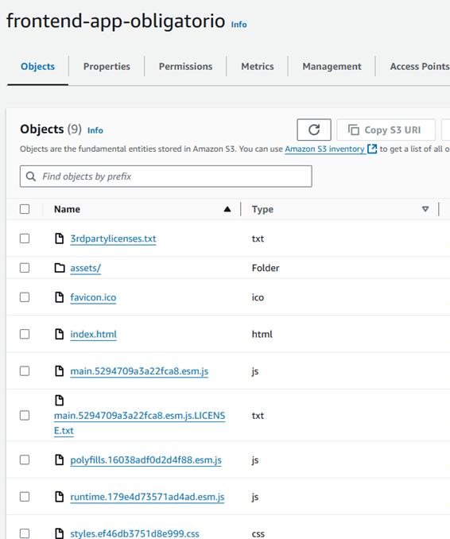


#### Configuración adicional: Política de seguridad del bucket

Para resolver el error 403 en el navegador, se agregó la siguiente política a nivel de configuración
en la herramienta aws en el bucket S3:

```json
{
  "Version": "2012-10-17",
  "Statement": [
    {
      "Effect": "Allow",
      "Principal": "*",
      "Action": "s3:GetObject",
      "Resource": "arn:aws:s3:::frontend-app-obligatorio/*"
    }
  ]
}
```

El siguiente es el archivo de configuración que se implementó y ejecutó para lograr el despliegue del código en el caso de las aplicaciones de backend.
El mismo contiene todas las referencias necesarias para construir en el recurso especificado el despliegue.

### Ejemplo de archivo deploy.yml


### Repositorios en AWS - ECR

La siguiente imagen muestra el repositorio construído en la herramienta AWS en el servicio ECR, que permitió alojar la imagen del aplicativo a deployar.


Por último se muestra la imagen ya deployada en EKR construído mediante GitActions luego de que corriera exitosamente el proceso CI/CD que construyó y luego despliegó el sistema.

Ejemplo de imagen creada con Github Actions:


### Pruebas de código estático

En todas las aplicaciones fueron aplicadas pruebas de análisis de calidad de código, mediante los servicios ofrecidos por la plataforma SonarCloud. Para realizar los mismos se creó una cuenta en la misma, se creó un repositorio en el sitio y se subió al mismo el código fuente mediante la vinculación a GitHub Accions.
De manera inmediata el código fue analizado y se mostraron en un dashboard los resultados de los diferentes aspectos revisados y las vulnearabilidades y errores encontrados.

El siguiente dashboard muestra para todas las aplicaciones testeadas, los resultados obtenenidos para cada uno de los tipos de análisis que se realizaron.

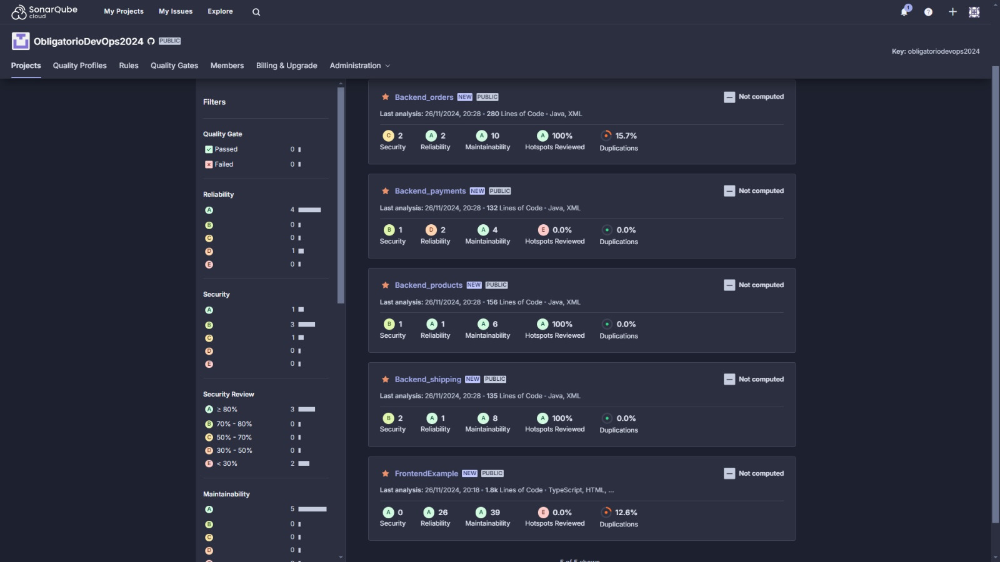

Informe:

De los valores que se obtienen de los resultados de aspectos específicos que fueron analizados por la herramienta, se pueden desprender las siguientes conclusiones:

Es de prioridad atender los 2 problemas de seguridad detectados, sería importante revisar la aplicación "Orders", ya que presenta un riesgo de tipo alto(2), y de criticidad importante a nivel de confidencialidad, compromiso de datos, acceso no autorizado, o ejecución de código.

También se concluye que tanto la aplicación de frontend como la de backend "orders", tienen código duplicado que se debería eliminar para mejorar la calidad del código del sistema.

Dado el resultado en el análisis "HostspostsReviewed" en el frontend y en la aplicación payments, es posible que el equipo no esté realizando revisiones de seguridad en el código, o no las esté registrando adecuadamente. Sería un punto a revisar para mejorar este aspecto de seguridad.

Por otra parte hay problemas que pueden estar relacionados con inconsistencia en la convención de nombres de variables. Sería conveniente revisar y mejorar este aspecto alineándose en manejar una convención definida como camelCase o snake_case para mejorar la legibilidad y mantenimiento del código.

### Construcción de orquestador y deploys

Se creó un orquestador de contenedores para poder manejar los mismos. A continuación se visualiza evidencia de cluster de Kubernete creado y su nodo asociado.

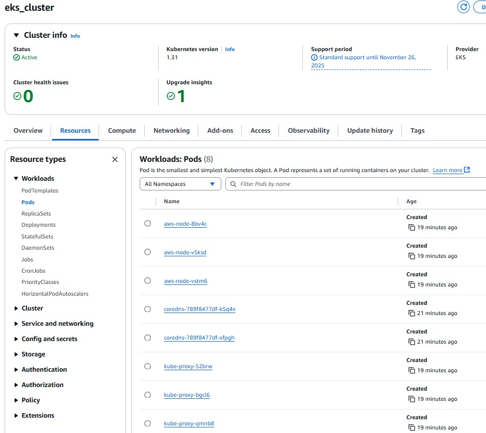

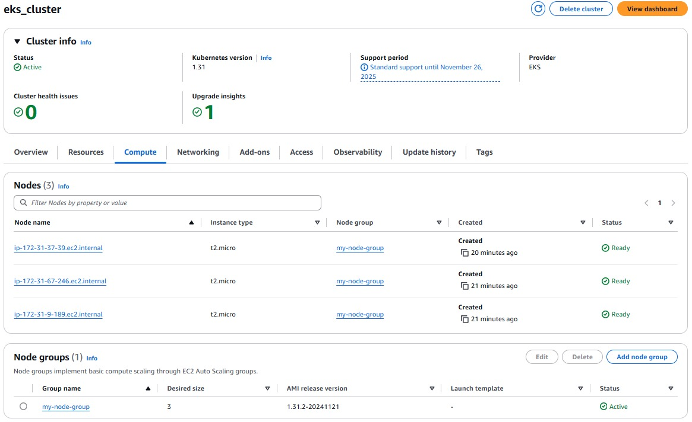

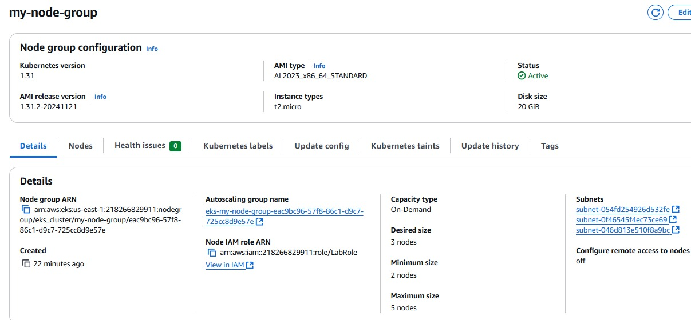

La siguiente imagen muestra los reporsitorios de imagenes que se crearon en AWS para poder alojar las imágenes del código fuente de las aplicaciones que posteriormente serán invocadas desde el orquestador de contenedores.

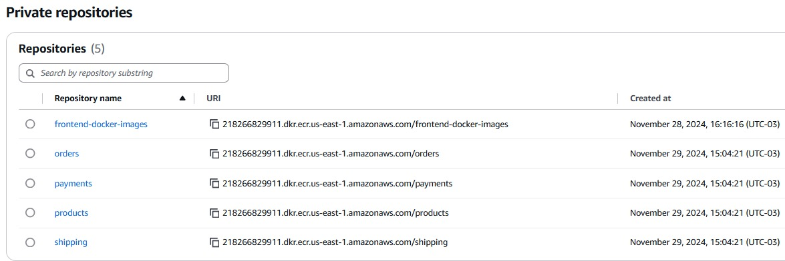

AWS nos permite visualizar el estado del proceso terraform según la siguiente imagen.

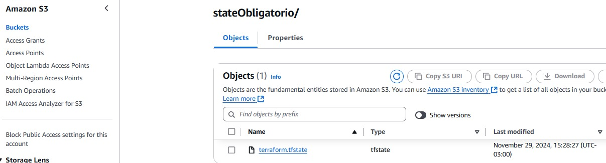
