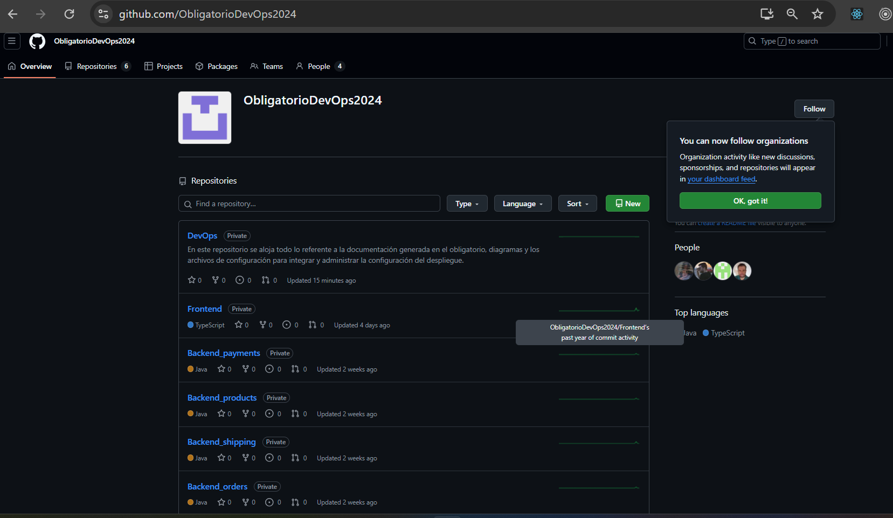

# DevOps

En este repositorio se aloja todo lo referente a la documentación generada en el obligatorio, diagramas y archivos de configuración para integrar y administrar la configuración de despliegue.

# Universidad ORT Uruguay

## Facultad de Ingeniería

### Obligatorio DevOps 2024

**Alejandra Medina - 295013**  
**Matías Santos - 168085**  
**Julio Peraza - 244103**

**Prof. Federico Barceló**

**2024**

---

### El desafío planteado

En el marco de la tarea obligatoria para la certificación DevOps, se le solicita al equipo presentar un plan de acción detallado que resuelva las problemáticas operativas y errores que presenta una empresa al poner nuevas versiones de código.

Se espera que la solución mejore la colaboración, confianza y aprendizaje continuo de los interesados en la puesta en funcionamiento del sistema.

---

### La solución lograda

La solución que planteamos, basada en la incorporación de herramientas de vanguardia, altamente confiables, muy utilizadas y probadas actualmente, organiza y facilita las pruebas y el despliegue de forma automática, rápida y con un margen de error mínimo.

Esto permite a la empresa ganar confianza y prestigio en la calidad del código publicado, además de liberar recursos para dedicarse a otras tareas a nivel de negocio.

#### Plan de despliegue para el frontend

- **Código fuente:** empaquetado en un bucket de **S3 de AWS**.
- **Aplicación:** accesible mediante un enlace generado para el navegador.
- **GitHub Actions:** configurado para vincular automáticamente el archivo con el bucket.

#### Plan de despliegue para las aplicaciones de backend

- **Orquestador:** Kubernetes para manejar los contenedores de backend.
- **Empaquetado:** cada aplicación Java será alojada en un contenedor Docker.
- **Configuración:** se generará un archivo Dockerfile vinculado al orquestador.

---

### Backlog de tareas

**Herramienta:** Microsoft Azure Boards  
**Link:** [https://dev.azure.com/ms168085ms/](https://dev.azure.com/ms168085ms/)


---


### CI CD WorkFlow


### Diagrama


---

### Repositorio GitHub

**Organización en GitHub:** [https://github.com/ObligatorioDevOps2024](https://github.com/ObligatorioDevOps2024)



Cada repositorio cuenta con tres ramas:

- **main:** contiene el código en producción. Solo se fusionan cambios después de pasar desarrollo y pruebas.
- **dev:** rama principal de desarrollo para integrar nuevas características.
- **test:** rama para pruebas, sirve como etapa de verificación antes de producción.

---

### Compilado de las aplicaciones de forma local

1. **order-service-example**

   

2. **payments-service-example**
   

3. **shipping-service-example**

   

4. **products-service-example**

   

---


### Despliegue de aplicación de frontend (React)


#### Configuración adicional: Política de seguridad del bucket

Para resolver el error 403 en el navegador, se agregó la siguiente política:

```json
{
  "Version": "2012-10-17",
  "Statement": [
    {
      "Effect": "Allow",
      "Principal": "*",
      "Action": "s3:GetObject",
      "Resource": "arn:aws:s3:::frontend-app-obligatorio/*"
    }
  ]
}
```
